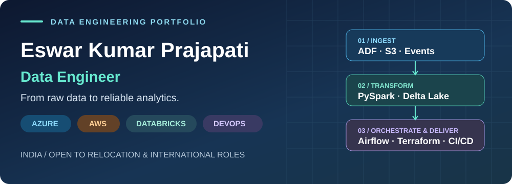
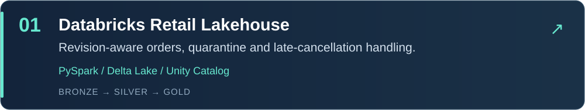
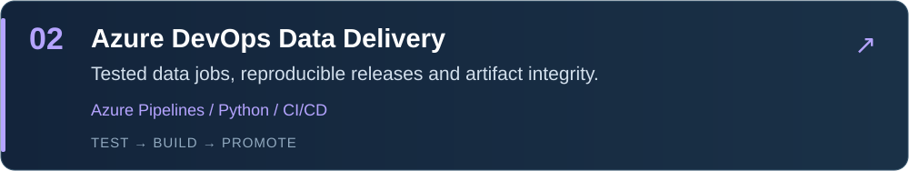
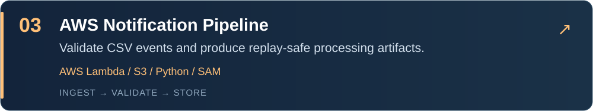
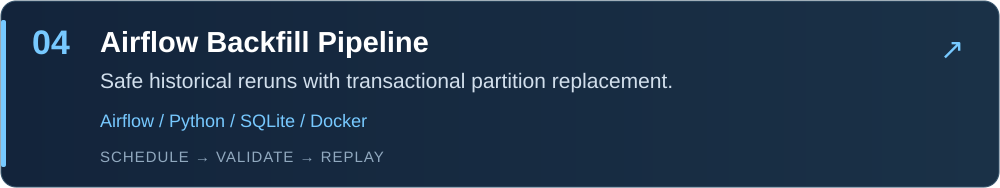
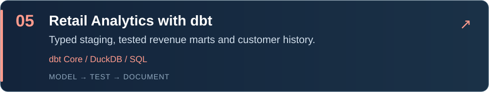
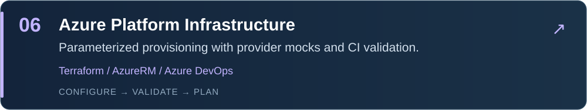

<b><a href="mailto:parjapateswar1@gmail.com">parjapateswar1@gmail.com</a> &nbsp; · &nbsp; +91 79810 23756</b> India · Open to relocation · Data Engineer / Senior Data Engineer opportunities

<a href="#featured-projects">Projects</a> &nbsp; / &nbsp; <a href="#technical-toolkit">Technical toolkit</a> &nbsp; / &nbsp; <a href="#experience">Experience</a> &nbsp; / &nbsp; <a href="#contact">Contact</a>

---

### Engineering data platforms from ingestion to delivery

I build cloud data pipelines and analytics platforms, with professional data-engineering experience since **November 2021**. Currently a **Data Engineer at sew.ai**, previously **Infosys**. My work connects **SFTP and MongoDB ingestion through Azure Data Factory**, **Python, SQL and PySpark transformations into Delta Lake under Unity Catalog**, **Snowflake and SQL performance optimization**, **Airflow orchestration**, **Terraform and Azure DevOps**, and **AWS Lambda/S3 notification data processing**.

**Lakehouse engineering** · **Data integration** · **Snowflake & warehousing** · **Streaming** · **DevOps & automation** · **Data reliability**

- **Ingestion:** SFTP servers, MongoDB, Azure SQL and PostgreSQL through ADF; AWS S3/event processing.
- **Transformation & governance:** Python, SQL and PySpark; Delta Lake tables governed through Unity Catalog in Databricks.
- **Warehousing & analytics:** Snowflake query optimization, PostgreSQL/SQL Server tuning, and curated data for Power BI.
- **Orchestration:** Apache Airflow and ADF pipeline dependencies; the portfolio also demonstrates a Databricks Jobs bundle.
- **Automation & delivery:** Terraform infrastructure as code, Azure DevOps and CI/CD; Docker and Kubernetes for workload execution.

## Featured projects

Explore the code, architecture and engineering decisions. These public portfolio implementations use synthetic data; each README documents its tests and cloud setup requirements.

**Also explore:** [Data Contract Monitor](https://github.com/Eswarprajapati/data-contract-monitor) — configurable schema, uniqueness, range and freshness checks with an audit trail.

## Technical toolkit

**Data integration, lakehouse & warehousing**

**Cloud, streaming & DevOps**

**Languages & analytics**

<b>View the complete skill set</b>

| Area | Tools and skills |
| --- | --- |
| Languages | Python · PySpark · SQL · PowerShell |
| Azure & lakehouse | Azure Databricks · Azure Data Factory · Synapse · Delta Lake · Unity Catalog |
| Ingestion sources | SFTP servers · MongoDB · Azure SQL · PostgreSQL · AWS S3 · Event data |
| AWS & warehousing | AWS Lambda · S3 · Redshift · Snowflake · Data warehousing |
| Streaming & orchestration | Apache Kafka · Streaming data processing · Apache Airflow · ETL/ELT · Medallion architecture |
| DevOps & automation | Azure DevOps · Terraform · GitHub · CI/CD · Docker · Kubernetes · Infrastructure as code |
| Databases & analytics | PostgreSQL · Azure SQL · SQL Server · Oracle · MongoDB · Power BI |
| Performance & quality | Spark tuning · Partitioning · Cluster optimization · SQL tuning · Validation · Cleansing · Low-downtime database migration |

### Azure Data Factory in the platform

My ADF experience includes ingestion from **SFTP servers, MongoDB, Azure SQL and PostgreSQL Flexible Server**, integrated with Databricks across bronze, silver and gold layers. **Python, SQL and PySpark** transform the landed data into **Delta Lake tables governed through Unity Catalog**. ADF manages source connectivity and ingestion dependencies; Databricks transforms the data; Azure DevOps delivers tested releases. [Read the integration design →](https://github.com/Eswarprajapati/databricks-retail-lakehouse/blob/main/docs/adf-integration.md)

<b>Portfolio implementation scope</b>

The toolkit reflects a broader skill set than these examples implement. Kafka is included in the streaming toolkit; these repositories do not implement a Kafka broker pipeline. Managed Databricks notebooks, ADF resources and Azure release promotion need a configured workspace/account. Repository READMEs describe verified code and cloud setup boundaries. No employer code or customer data is published.

## Experience

**sew.ai · Data Engineer · May 2026–present**  
Utility/energy data platforms · Databricks and medallion architecture · Spark tuning · Analytics delivery

**Infosys · Data Engineer · November 2021–April 2026**  
ETL/ELT and ADF integration · Airflow on Docker/Kubernetes · Terraform and Azure DevOps · PostgreSQL migration · SQL optimization across PostgreSQL, SQL Server and Snowflake

<b>Education, recognition & internal certifications</b>

- **B.Tech, Mechanical Engineering:** Aditya Institute of Technology and Management · 84.3% · Silver Medal (2022).
- **Infosys internal certifications:** Databricks Associate, Azure Fundamentals, MySQL Associate, Global Agile Developer.
- **Recognition:** Infosys Insta Awards (2022–2025), Business Ninja 2025, 7th place in the Beyond the Prompt Hackathon (Microsoft & Infosys).

## Contact

Interested in a data engineer who connects pipelines, platforms and delivery? I’m open to **Data Engineer and Senior Data Engineer roles in India and internationally**, including relocation.

- **Email:** [parjapateswar1@gmail.com](mailto:parjapateswar1@gmail.com)
- **Phone:** +91 79810 23756
- **LinkedIn:** [Eswar Kumar Prajapati](https://www.linkedin.com/in/prajapati-eswar-kumar-396123170)
- **Location:** India · Open to relocation
